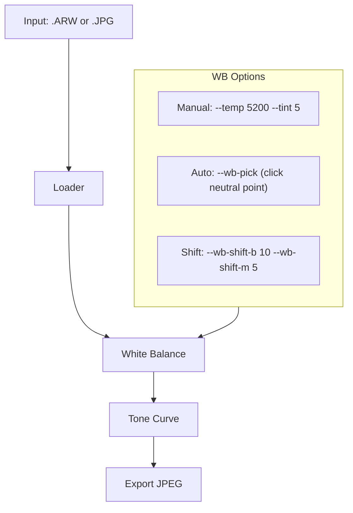

# Image Processing Pipeline CLI

## Architecture

Single Python package with a CLI entry point. One main pipeline module, separated processing steps.

```
image_raw/
  pipeline.py          # Main CLI entry point
  core/
    __init__.py
    loader.py           # RAW (.ARW) + JPEG loader
    white_balance.py    # WB correction (temp/tint + auto pick white)
    tone.py             # Tone curve (shadows, highlights, contrast, brightness)
    export.py           # JPEG export with quality settings
  requirements.txt
  README.md
```

## Dependencies

- **rawpy** -- LibRaw wrapper, reads Sony .ARW files and demosaics
- **numpy** (already installed) -- array math for pixel manipulation
- **Pillow** (already installed) -- JPEG read/write, image I/O
- **imageio** -- bridge between rawpy output and pipeline (optional, rawpy returns numpy arrays directly)

Only **rawpy** needs to be installed. numpy and Pillow are already available.

## Pipeline Flow




## Key Implementation Details

### 1. Loader (`core/loader.py`)

- Detect file type by extension (.ARW/.arw = RAW, else JPEG)
- RAW: use `rawpy.imread()` then `postprocess()` with `no_auto_bright=True`, `output_bps=16` to get maximum data
- JPEG: use `PIL.Image.open()` then convert to numpy float64 [0, 1] range
- Return standardized numpy array (H, W, 3) float64 in [0, 1]

### 2. White Balance (`core/white_balance.py`)

- **Temperature shift**: Convert to a simple R/B channel gain model
  - Higher temp (warmer) = boost R, reduce B
  - Lower temp (cooler) = reduce R, boost B
  - Reference: daylight ~5200K, shade ~7000K, tungsten ~3200K
- **Tint shift**: G/M axis -- adjust green channel
- **Auto neutral pick**: Given a coordinate (x, y), sample that pixel region, compute correction gains to make it neutral gray, apply globally
- **WB shift A/B and G/M**: Direct channel multiplier adjustment (like Sony's menu WB Shift)

### 3. Tone Curve (`core/tone.py`)

- **Brightness**: Simple linear scale
- **Contrast**: S-curve centered at midtones
- **Shadows**: Lift shadow region (raise blacks)
- **Highlights**: Compress highlight region (recover whites)
- Implementation: piecewise bezier or simple gamma-based curve applied per channel

### 4. Export (`core/export.py`)

- Convert float64 [0, 1] back to uint8 [0, 255]
- Clamp values
- Save via Pillow with configurable JPEG quality (default 95)
- Preserve EXIF from original if available

## CLI Interface (`pipeline.py`)

```
python pipeline.py input.ARW -o output.jpg \
  --temp 5200 \
  --tint 5 \
  --brightness 0.1 \
  --contrast 0.2 \
  --shadows 0.1 \
  --highlights -0.1 \
  --quality 95
```

Additional flags:

- `--wb-auto` -- auto white balance (gray world assumption)
- `--wb-pick X,Y` -- pick neutral point at pixel coordinate
- `--batch INPUT_DIR` -- process all .ARW/.JPG in a directory
- `--compare` -- output side-by-side original vs processed
- `--info` -- print image info (size, EXIF, detected WB)

## Solving the Core Problem

The user's main issue: AWB preserves warm ambient, making white flowers yellow.

The pipeline fixes this by:

1. **Manual temp**: Set `--temp 5200` to force daylight WB regardless of scene
2. **Pick white**: Use `--wb-pick X,Y` on a white flower petal to auto-neutralize
3. **WB shift**: Use `--wb-shift-b 10` to push blue, counteracting the yellow cast

For the sample `DSC00038.JPG`: the background is warm olive/yellow, flowers are purple. A temp correction of ~5000-5200K + slight blue shift should clean up the color cast while maintaining natural look.