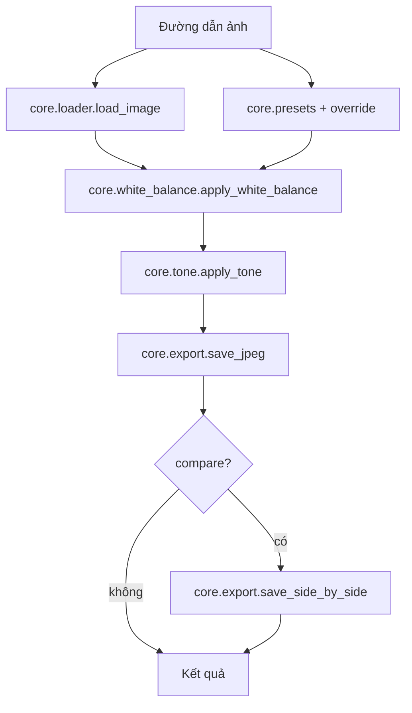

# Pipeline xử lý ảnh (nghiệp vụ lõi)

Repo này **tập trung** vào luồng xử lý pixel và preset. Triển khai (hosting, domain, storage, IAM, v.v.) nằm ngoài phạm vi tài liệu này.

## Luồng tổng quát

## Entry points gọi engine

| Cách gọi | Mục đích |
|----------|----------|
| `pipeline.py` | CLI, batch, thử nhanh |
| `python -m core.api` | JSON stdin → xử lý (bridge / automation) |
| `core.engine.process_image(ProcessImageRequest)` | Thư viện Python (mobile bridge, FastAPI, test) |
| `desktop/bridge/process-job-cli.mjs` | Gọi `core.api` từ Node |
| `apps/server` | HTTP mỏng: upload → `process_image` → trả file (tùy chọn khi dev) |

## `ProcessImageRequest` → tham số hiệu lực

1. **Preset** (nếu có): merge dict từ `core.presets.PRESETS[preset]`.
2. **`settings`**: ghi đè từng khóa (chỉ key khác `None`).
3. Kết quả gói thành `EngineSettings` → tách **white balance** và **tone**.

Các trường chính: `temp`, `tint`, `wb_shift_*`, `wb_auto`, `wb_pick` + `wb_pick_radius`, `brightness`, `contrast`, `shadows`, `highlights`.

## Sau xử lý

- Ảnh ra: JPEG, giữ EXIF gốc khi có (`loader` đọc `exif_bytes`).
- `compare=True`: thêm ảnh ghép trước/sau cạnh nhân.

Nguyên tắc chất lượng chia sẻ (so với IG/Threads, file nguồn): [principles.md](principles.md).

## Tag EXIF + share video (optional)

- **`core.exif_tags`**: đọc Make/Model, lens (nếu có), khẩu độ, tốc, ISO, tiêu cự từ JPEG/TIFF có EXIF (không đọc file RAW thô).
- **`core.share_video`**: ghép ảnh + chữ (ASS) → MP4 H.264 qua **ffmpeg** (cần `ffmpeg` trên PATH, bản build có **libass**).
- CLI: `python3 tools/render_share_video.py <ảnh.jpg> -o out.mp4` (mặc định dọc 1080×1920; `--landscape` cho 1920×1080). Xem tag: `--tags-json`.
- HTTP (mobile Video B **server**): `POST /social/share-video` trên `apps/server` — upload ảnh, server gọi `render_share_video` (cần **ffmpeg** trên host), trả `files.video` + tải qua `GET /files/outputs/...`.
- On-device (mobile Video B): `apps/mobile/src/video/*` + **ffmpeg-kit-react-native** (`expo run:android`, không Expo Go).
- **`core.share_image`**: ảnh JPEG social (chỉ Pillow) — Story 9:16, feed 4:5, vuông 1:1 + gradient + tag EXIF.
- CLI: `python3 tools/render_social_image.py <ảnh> -o out.jpg` (`--format story|feed|square`, `--tier hq|ig`, `--no-brand`). Canvas **tối thiểu 2K** (cạnh ngắn ≥2048px); mặc định **hq** = 2560px ngang + JPEG cao (platform vẫn có thể nén lại khi upload).

## Preset mới

Thêm mục trong `core/presets.py` (dict khóa–giá trị cùng schema với `EngineSettings`). Ghi lại use case trong `usecases/case_log_*.md` nếu là bài toán thật.

## Hợp đồng cross-platform

`shared/contracts/processing.schema.json` và `presets.json` mô tả tham số cho UI/adapter — đổi pipeline nên cập nhật schema khi có field mới.

## Kiểm thử parity

- `tools/check_preset_parity.py`
- `tools/validate_cross_platform.py` với `tests/cross_platform_pairs.json`
