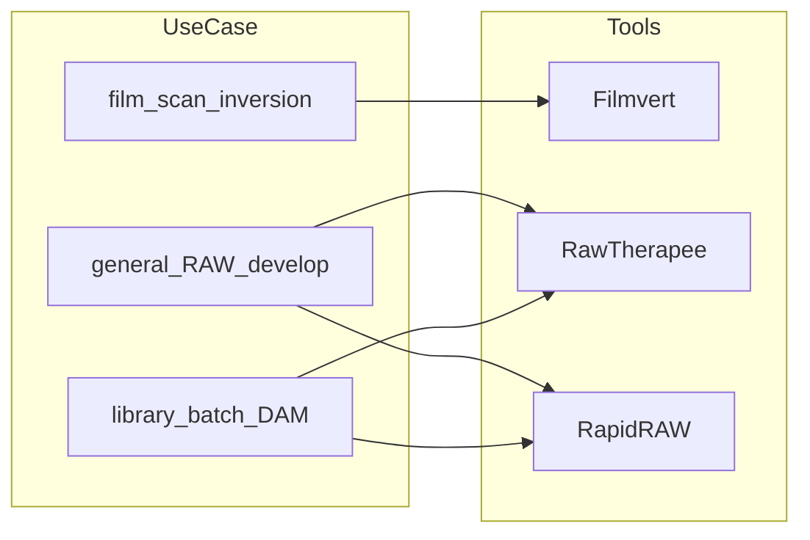

# Phân tích nội dung / comment: Reddit RapidRAW + ba công cụ (Filmvert, RawTherapee, RapidRAW)

Tài liệu triển khai plan phân tích (không sửa file plan gốc). Cập nhật: có dữ liệu Reddit trong repo + đọc lại thread Hacker News.

## Nguồn

| Nguồn | URL / artifact |
|--------|----------------|
| Reddit r/photography | [Thread RapidRAW](https://www.reddit.com/r/photography/comments/1lnj348/i_built_a_opensource_lightweight_raw_editor_in_2/) |
| Export comment (repo) | [reddit_comments.json](../reddit_comments.json), [reddit_comments.csv](../reddit_comments.csv) — 150 comment, `scrapedAt` 2026-04-06 |
| Hacker News (proxy kỹ thuật) | [item?id=44505876](https://news.ycombinator.com/item?id=44505876) (~126 comments) |
| Filmvert | [github.com/montoyatim01/Filmvert](https://github.com/montoyatim01/Filmvert) |
| RawTherapee | [rawtherapee.com](https://www.rawtherapee.com/) |
| RapidRAW | [github.com/CyberTimon/RapidRAW](https://github.com/CyberTimon/RapidRAW) |

---

## 1. Bài đăng gốc Reddit (self-post) — không nằm trong CSV/JSON

Tiêu đề:

> I built a open-source lightweight RAW editor in 2 weeks because Lightroom felt too heavy on my machine

Nội dung (tóm ý): tác giả 18 tuổi, Lightroom trên Windows bất ổn khi batch RAW → tự làm **RapidRAW** (GPU, non-destructive, OSS, Rust + Tauri + React, &lt;30MB, Win/macOS), có library, mask (kể cả AI), batch, preset; xin ý kiến photographer; link GitHub; PS xin mod xóa nếu coi là self-promo.

*(Toàn văn body đã được user cung cấp trong phiên chat; file export chỉ chứa comment.)*

---

## 2. Phân tích comment Reddit (150 mục trong `reddit_comments.json`)

### 2.1 Thống kê nhanh

- **150** comment; threading bật; vài mục `[removed]` / `[deleted]`.
- OP trả lời dưới tên **zBlackVision11** (hàng chục reply — tương tác cao).
- Comment đầu tiên trong export **không** phải bài gốc mà là top-level đầu tiên (ví dụ **InfiniteSys**, score 172).

### 2.2 Chủ đề chính (bằng chứng từ thread)

**Chất lượng / UX điều chỉnh**

- Whites/Blacks slider ngược trực giác; shadows tạo “grey haze”; cần reset rõ ràng hơn (double-click header — OP đồng ý cải thiện UX/cursor).
- Gợi ý tỷ lệ **5:4** (Instagram); OP chấp nhận cho bản tiếp theo.

**So sánh hệ sinh thái OSS**

- Gợi ý thử [RawTherapee](https://www.rawtherapee.com/) (xmillies, score 58).
- OP đề cập đã thử **Darktable**; chọn học React/Rust và pipeline camera.

**Cộng đồng chuyên sâu**

- Khuyên đăng trên [discuss.pixls.us](https://discuss.pixls.us); lưu ý theme sáng/tối ảnh hưởng nhận thức độ bão hòa (tham chiếu FAQ Darktable) — **Donatzsky**.

**Film negative / Filmvert — khớp plan “3 công cụ”**

- Hỏi **negative conversion** và khó chỉnh base color trong Darktable.
- Comment giới thiệu **[Filmvert](https://github.com/montoyatim01/Filmvert)** cho workflow đảo negative.
- Người quét **film** (JPEG/BMP scan): OP nói sẽ làm film inversion; lúc đó **chưa hỗ trợ TIFF**.

**Pipeline / color science**

- **v270**: LibRaw → gắn với demosaic/color kiểu dcraw, hỏi CR3 nén và layer custom vs UI+GPU.

**macOS & phân phối**

- Build chưa ký; hướng dẫn terminal để chạy; tranh luận thực tế cho người dùng Mac.

**Gần thay Lightroom + backlog sản phẩm**

- Feedback dài (scroll wheel vs panel, crop/zoom, 1:1 crop, flip, AI mask, brush offset, Winget, …) được OP gom lên **GitHub issue #26** — roadmap thực dụng.

**Khác**

- Tranh luận nhẹ về **tên** RapidRAW (Arrested Development “Raw” meme).
- Thread Reddit **ít** đào **AGPL** so với HN (tập trung dùng thử và UX).

### 2.3 So với giả thuyết plan ban đầu

Plan liệt kê: LR/C1, DT/RT, AGPL, Tauri/React, tuổi/Gemini. Trên **Reddit thực tế**: mạnh nhất là **bug/UX**, **macOS signing**, **Filmvert cho negative**, **LibRaw**, **pixls.us** — AGPL gần như không xuất hiện trong 150 comment.

---

## 3. Hacker News `44505876` — “comment sâu” bổ sung

Thread cùng dự án RapidRAW; ~278 points, ~126 comments. Các lớp ý chính:

**RawTherapee**

- Ca ngợi **màu học**, CLI, [RawPedia](https://rawpedia.rawtherapee.com/); cảnh báo thuật ngữ sâu (demosaicing, CAM16, …); thiếu **HDR output** (mong PNG v3 / Rec.2100) — *strogonoff*.

**UX vs Lightroom**

- “Good UX và workflow đa ảnh thắng chi tiết kỹ thuật”; RT &gt; DT nhưng vẫn thấp hơn LR; lý do người ta trả tiền LR — *Sharlin*.
- Denoise và preview realtime của LR được nhắc nhiều so với RT — *Jaxan*, *Sharlin*.

**OSS “nhiều nút” vs use case kỹ thuật**

- Tranh luận: DT/RT phục vụ microscopy, negative, scan — không chỉ ảnh sáng tạo; AI masking thiếu vì năng lực cộng đồng — *orbital-decay* vs *t0bia_s*.

**RT vs Darktable**

- Filmic DT để “cứu” raw quá sáng; phân biệt với highlight reconstruction RT — *thrtythreeforty*, *virtualritz*.

**Local adjustment**

- RT hạn chế so DT path masks; **ART (Another RawTherapee)** gợi ý cho masking kiểu LR — *donatzsky*, *mikae1*.

**Kiến trúc RapidRAW**

- Lag khi load folder; phân tích **thumbnail + base64 qua IPC Tauri** (nhân bản bộ nhớ) — *TheDong*; OP (cybertimon) thừa nhận chưa tối ưu.

**Sidecar / catalog**

- `.rrdata` vs thư viện — portability khi đổi thư mục/máy — *cybertimom* vs ý kiến Lightroom relink được — *dylan604*.

**Khác**

- README GIF nặng; macOS code signing $99; “vibe coding” / Gemini trong README — các nhánh phụ.

---

## 4. Ba công cụ (tóm tắt định vị)

### Filmvert

- **Mục tiêu:** đảo **negative phim** theo roll, workflow lặp lại.
- **Kỹ thuật:** C++, float, **OpenColorIO**, RAW/Pakon/TIFF/DNG; Conan/CMake.
- **License:** MIT.
- **UX đặc thù:** vùng phân tích 4 góc, loại sprocket/scanner, base color, Analyze + bias.

### RawTherapee

- RAW cross-platform, **GPLv3**, engine 32-bit float, demosaicing và chỉnh màu/chi tiết nâng cao.
- Định vị: chất lượng + tài liệu ([RawPedia](https://rawpedia.rawtherapee.com/)); curve học dốc.

### RapidRAW

- **Rust, Tauri, React, WGSL/wgpu**; non-destructive (sidecar `.rrdata`); **AGPL-3.0**.
- Thư viện ảnh, mask AI, tone mapping, negative conversion (roadmap), lensfun, batch — nhấn mạnh tốc độ GPU và UI hiện đại; tác giả thừa nhận chưa ngang DT/RT/LR về độ trưởng thành.

---

## 5. Bản đồ use case → công cụ

---

## 6. Chọn công cụ theo nhu cầu (hoàn thành todo “match-needs”)

| Nhu cầu của bạn | Ưu tiên công cụ | Ghi chú |
|-----------------|-----------------|--------|
| Quét negative / roll phim, base color, OCIO | **Filmvert** | Được chính thread Reddit gợi ý cho negative; không thay RT/RR cho mọi RAW digital. |
| Tối đa kiểm soát màu/demosaic, tài liệu học, script CLI | **RawTherapee** | HN nhấn mạnh độ sâu; trade-off UX và local adjustments. |
| Workflow kiểu Lightroom nhẹ, GPU, thư viện, AI mask (đang phát triển), một app hiện đại | **RapidRAW** | AGPL; feedback Reddit/HN = WIP nhưng tiềm năng, cần polish UX và pipeline. |
| Chỉnh raw quá sáng kiểu “filmic”, path mask mạnh | **Darktable** / **Ansel** | Xuất hiện trong HN so sánh với RT; không nằm trong “3 nguồn” chính của plan nhưng là alternative OSS liền kề. |

---

## 7. Kết luận

1. **Reddit:** Đã có **150 comment** trong repo; **thiếu** metadata submission trong export — cần ghép thủ công tiêu đề + body (mục 1) khi phân tích toàn thread.
2. **HN `44505876`:** Bổ sung lớp **kỹ sư** (IPC, sidecar, tranh luận RT/LR/OSS philosophy) mà Reddit cùng chủ đề ít đào AGPL.
3. **Filmvert** là mảnh ghép **negative/film** trong đúng câu chuyện Reddit; **RT** là trục “màu học”; **RapidRAW** là trục “LR-like + GPU + OSS”.

---

## 8. Trạng thái công việc plan

- **reddit-local:** Đã dùng export `reddit_comments.json` / `.csv` trong workspace thay cho truy cập tự động Reddit (vốn bị hạn chế).
- **hn-read:** Đã đọc lại [HN #44505876](https://news.ycombinator.com/item?id=44505876) (scrape 2026-04-06).
- **match-needs:** Bảng mục 6.
