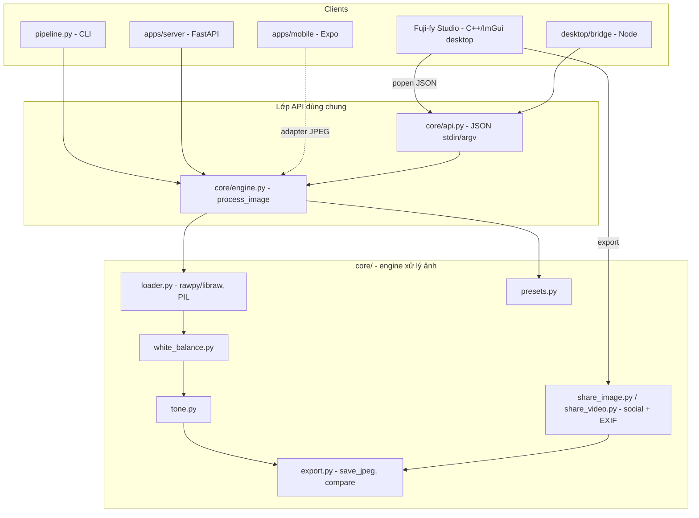

# Bảng thiết kế phần mềm — Fuji-fy

Tài liệu thiết kế kiến trúc cho **Fuji-fy**: engine xử lý ảnh dùng chung (`core/`) và các
client bao quanh nó — trong đó có **Fuji-fy Studio** (app desktop ImGui, POC ở `imgui-poc/`).

> Liên quan: [pipeline.md](pipeline.md) (flow engine), [product-model.md](product-model.md)
> (mô hình doanh thu), [market-research.md](market-research.md) (thị trường).

---

## 1. Mục tiêu & phạm vi

- **Một engine, nhiều client.** Toàn bộ logic ảnh (decode RAW/JPEG, white balance, tone,
  preset, export social) nằm ở `core/` (Python). CLI, HTTP server, mobile, desktop **không
  được** cài lại logic này — chỉ gọi qua cùng một API.
- **Core miễn phí**; doanh thu ở **Storage** (quota) + **Ads** (Premium tắt ads). Tách bạch:
  monetization KHÔNG nằm trong pipeline ảnh.
- Chất lượng "trên chuẩn IG/Threads ở tầng file nguồn" (social ≥2K, JPEG 4:4:4) — xem
  [principles.md](principles.md).

---

## 2. Kiến trúc tổng thể



**Nguyên tắc trục:** mọi client đi qua `process_image()` (hoặc `core/api.py` cho client
ngoài Python). Không client nào tự decode RAW hay tự tính WB/tone.

---

## 3. Thành phần

| Module | Trách nhiệm | Ghi chú |
|---|---|---|
| `core/loader.py` | Decode ảnh → RGB float64 [0,1] | RAW qua **rawpy/libraw** (lazy import); JPEG/PNG qua **PIL**. `RAW_EXTENSIONS` = arw/dng/nef/cr2/raf/rw2. |
| `core/white_balance.py` | Temp/tint, shift, auto gray-world, pick neutral | `WhiteBalanceSettings`. |
| `core/tone.py` | Brightness/contrast/shadows/highlights | `ToneSettings`. |
| `core/export.py` | Ghi JPEG (+EXIF), ảnh so sánh side-by-side | `save_jpeg`, `save_side_by_side`. |
| `core/presets.py` | Preset đã lưu (case01…, default_indoor, nex5n…) | `PRESETS` dict. |
| `core/engine.py` | Orchestrator: `process_image(request)` | `EngineSettings`, `ProcessImageRequest/Result`. |
| `core/api.py` | Vỏ JSON cho client ngoài (stdin/argv) | Trục tích hợp cho Studio & bridge. |
| `core/share_image.py` | Render ảnh social (story/feed/square) + EXIF | Dùng bởi `tools/render_social_image.py`. |
| `imgui-poc/fujify_studio.cpp` | **Fuji-fy Studio** — GUI desktop | Xem §5. |

---

## 4. Luồng xử lý ảnh (1 lần Apply)

```
input_path + settings(JSON)
  → load_image()         # RAW: rawpy.postprocess(linear 16-bit); JPEG: PIL
  → _effective_settings  # preset → override bằng settings của user
  → apply_white_balance
  → apply_tone
  → save_jpeg(output_path, quality, exif)   # (+ compare nếu cần)
  → ProcessImageResult{ ok, output_path, effective_settings, elapsed_ms, info }
```

`EngineSettings`: `temp, tint, wb_shift_{a,b,g,m}, wb_auto, brightness, contrast, shadows,
highlights, wb_pick, wb_pick_radius`. Preset là baseline; `settings` của client ghi đè field
khác `None`.

---

## 5. Fuji-fy Studio (desktop, C++/ImGui)

App native nhỏ chứng minh editor desktop **tái dùng engine Python**, không nhân bản logic.

### 5.1 Pipeline GUI ↔ engine ↔ texture

```
GUI (ImGui)
  → ghi payload JSON (input_path, settings, preset, output_path=/tmp/...)
  → popen: cd <root> && python3 -m core.api payload.json
       core/api → process_image → (rawpy decode + WB + tone) → ghi JPEG
  → stb_image decode JPEG → glTexImage2D → ImGui::Image (draw-list)
Export:
  → popen: tools/render_social_image.py <processed.jpg> --format … --tier …
```

Quyết định: **không decode RAW trong C++**. Một code path duy nhất với CLI/server → không
trôi lệch color science.

### 5.2 Mô hình luồng (UI thread vs worker)

```mermaid
sequenceDiagram
  participant UI as UI thread (GL context)
  participant W as Worker thread
  UI->>W: start_process()/start_export() (snapshot params, busy=true)
  W->>W: popen engine/export (CPU/IO ~1-2s)
  W-->>UI: atomic done=true (+ log, ok, reload_texture)
  UI->>UI: join(); nếu reload → glTexImage2D (chỉ UI thread chạm GL)
  Note over UI: mỗi frame vẫn render 60fps; ProgressBar hiển thị tiến độ
```

- **UI thread** sở hữu GL context → mọi `glTexImage2D` chạy ở đây. **Worker** chỉ làm
  popen + file IO + dựng string.
- Đồng bộ bằng `std::atomic` (busy/done/steps) + `std::mutex` cho log/label.
- **Progress**: batch export báo `n/3` thật; decode đơn lẻ dùng bar *indeterminate*.

### 5.3 Viewport — zoom/pan

Vẽ texture qua `ImDrawList::AddImage` + `PushClipRect`; cuộn = zoom (0.1–8×), kéo trái =
pan, nút **Fit** / **100%**. Không tạo lại texture khi zoom.

### 5.4 i18n (Latin / Tiếng Việt / 日本語)

Font ImGui mặc định chỉ ASCII. `setup_fonts()` load **Inter** (font UI của IntelliJ) cho
Latin+Việt và **merge Hiragino** cho glyph Nhật (`ImFontConfig::MergeMode`). Glyph ranges:
`Default + Vietnamese + Japanese`.

### 5.5 Build

`imgui-poc/Makefile`: clang++ C++11, link GLFW + framework macOS, `-pthread`, truyền
`-DFUJIFY_ROOT`. Phụ thuộc: `glfw` (brew), `rawpy/Pillow/numpy` (pip), `stb_image.h`.

---

## 6. Yêu cầu phi chức năng

| Khía cạnh | Hiện trạng POC | Hướng production |
|---|---|---|
| **Hiệu năng** | decode RAW ~1s; re-process mỗi lần Apply | live preview + debounce; cache decode RAW |
| **Bộ nhớ** | full-res (NEX-5N 4920×3276 ≈ 64MB RGBA) | **proxy downscale** để hiển thị/preview; gốc giữ ở Storage |
| **Đồng thời** | 1 worker tuần tự, không cancel | queue + huỷ job; thread pool |
| **Tách tiến trình** | popen Python mỗi lần | engine daemon / IPC bền |
| **Bảo mật** | popen với path dựng chuỗi (POC) | validate/escape input, sandbox |
| **Portability** | macOS (GLFW+OpenGL3) | Win/Linux cùng backend; cân nhắc Metal |

---

## 7. Mô hình doanh thu (tóm tắt, chi tiết ở product-model.md)

Core (editor + pipeline) **free**. **Storage** là paywall tự nhiên — RAW nặng nên người
dùng cần backup cloud. **Ads** cho free tier; **Premium** tắt ads + quota. Monetization là
tầng tách rời, không đụng `core/`.

---

## 8. Hạn chế & roadmap POC

- Re-process/export đồng bộ (đã đẩy sang worker thread, nhưng vẫn 1 job/lần).
- Chưa có proxy/library/catalog, chưa non-destructive sidecar.
- Đề xuất kế tiếp: (1) engine xuất proxy; (2) live preview debounce; (3) queue+cancel;
  (4) export "Open in Finder"; (5) đóng gói `.app` bundle có ký.
